# ClickCart

ClickCart is an e-commerce order management system designed to handle the full lifecycle of an online purchase — from product browsing to order placement, payment processing, and shipping management. The system integrates multiple modules and external entities to ensure smooth transactions and logistics for customers, administrators, and shipping providers.

# 🚀 Features
Customer Experience: Browse products, place orders, and make payments through a streamlined interface.

Order Management: Efficient handling of order details, inventory validation, and coordination with payment and shipping systems.

Payment Integration: Secure transaction processing through a third-party payment gateway.

Inventory Control: Real-time stock updates and product data maintenance by administrators.

Shipping Coordination: Integration with shipping providers to track and confirm order deliveries.

Admin Dashboard: Manage products, monitor orders, and maintain system data.

# 🧩 System Modules Overview
1. Order Management 
Handles order placement and tracking.

Coordinates with inventory, payment, and shipping modules.

Retrieves and updates data in the Orders Database (D1).

2. Payment Processing 
Sends payment requests to the payment gateway.

Confirms payment and updates customer on order status.

3. Inventory Management 
Updates product and stock information.

Syncs with the Inventory Database (D2) to reflect stock changes.

4. Shipping Management System 
Receives confirmed orders for delivery.

Updates delivery status and confirms shipment with the shipping provider.

# 🔗 External Entities
Customer: Interacts with the system to place and pay for orders.

Admin: Manages product listings and oversees order processing.

Payment Gateway: Processes payment transactions securely.

Shipping Provider: Handles physical delivery and shipment updates.

## Members

- [Muhamed Hamed](https://github.com/muhamedhamedvl)
- [Adham Assem](https://github.com/sioranx69)
- [Mohand Sadek](https://github.com/Muhanned-Sadk)
- [Ahmed ELSabakhy](https://github.com/Ahmed-Alsebakhy)
- [Youssef Elabher](https://github.com/usifelabher)

## Documentation

[Presentaion](https://drive.google.com/file/d/1UoKF0Ohr2b-b3aeeBLQldeUiVMpaA5TM/view?usp=sharing)
________________________________________________________________________________________________________________________________________________
## Register
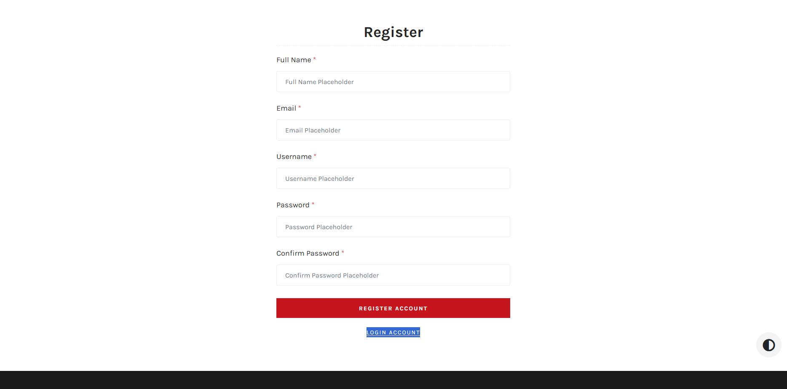
________________________________________________________________________________________________________________________________________________
## Login
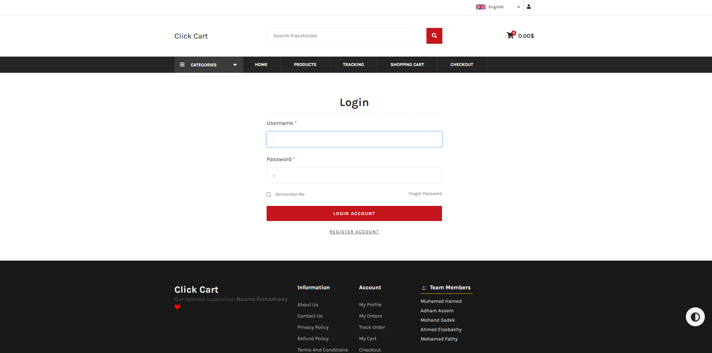
________________________________________________________________________________________________________________________________________________
## Home
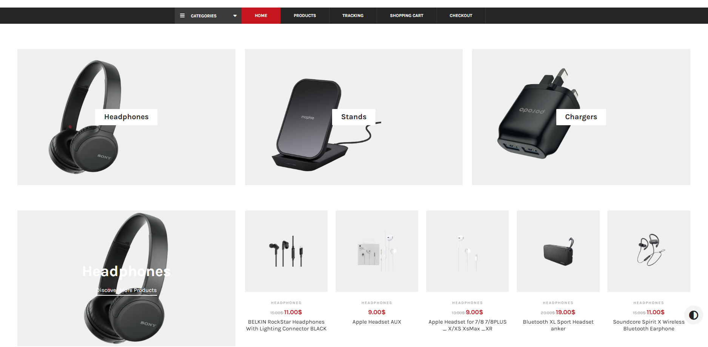
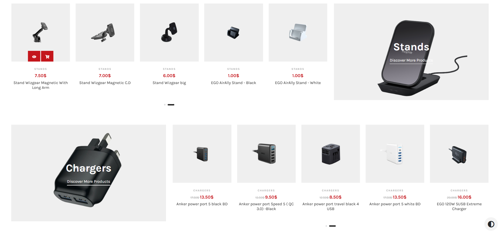
________________________________________________________________________________________________________________________________________________
## Details Of Product

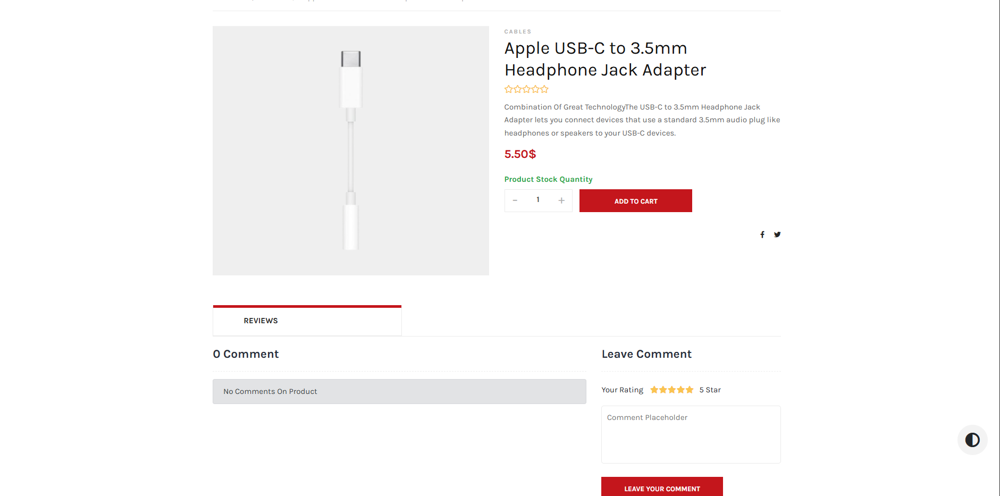
________________________________________________________________________________________________________________________________________________
## Cart
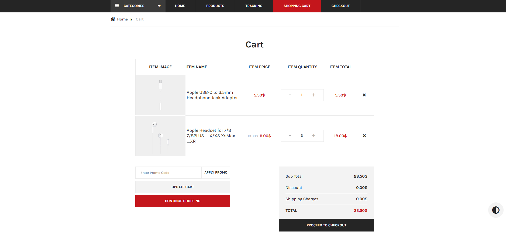
________________________________________________________________________________________________________________________________________________
## CheckOut
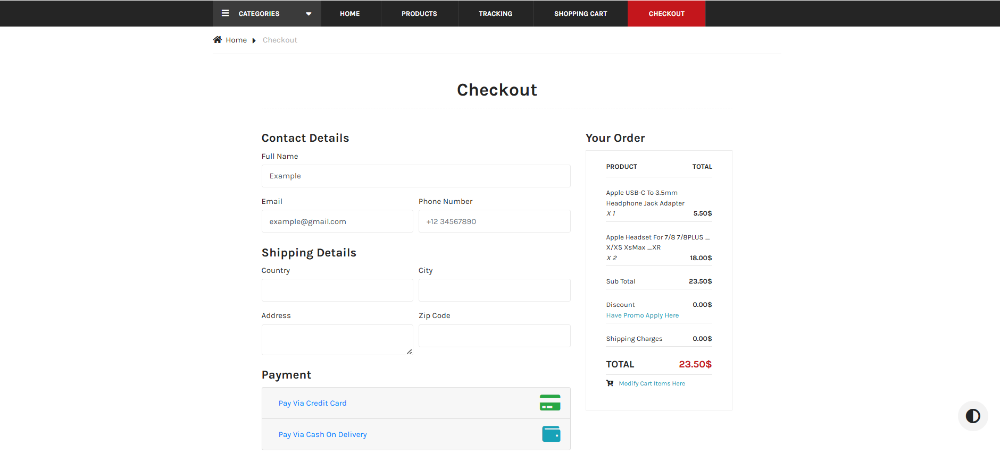
________________________________________________________________________________________________________________________________________________
## Validation Checkout
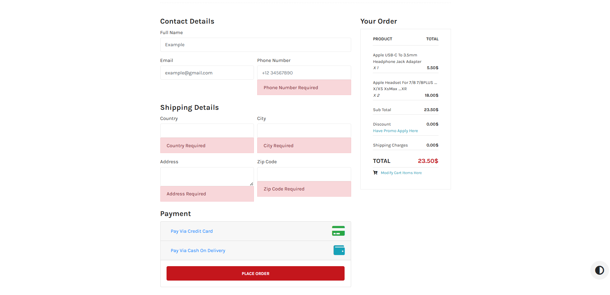
________________________________________________________________________________________________________________________________________________
## Visa Payment
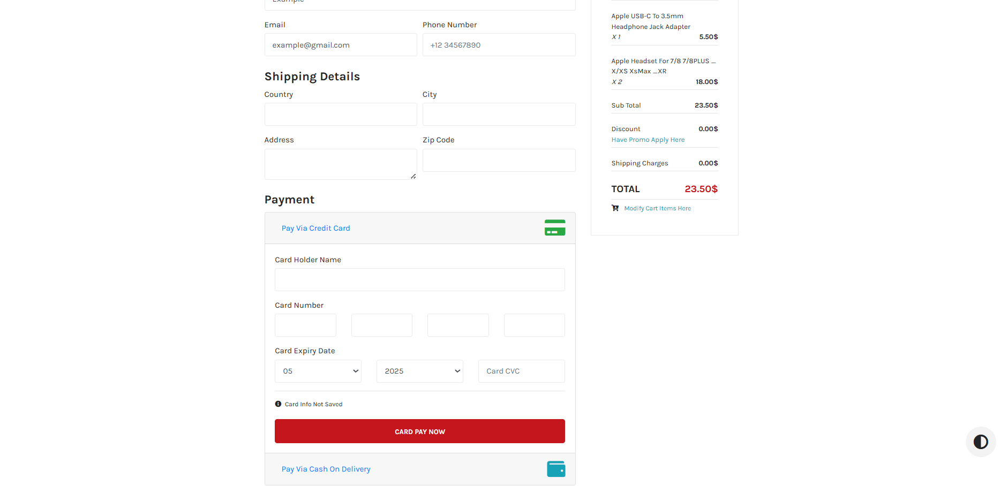
________________________________________________________________________________________________________________________________________________
## Order Success
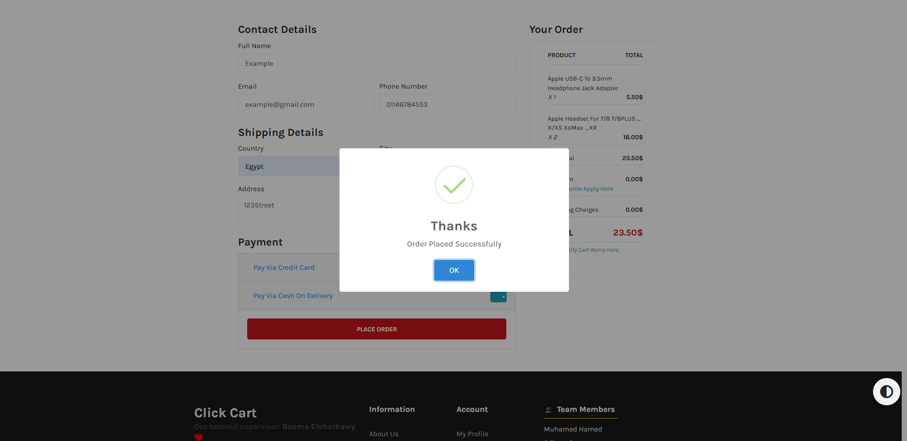
________________________________________________________________________________________________________________________________________________
## Invoice
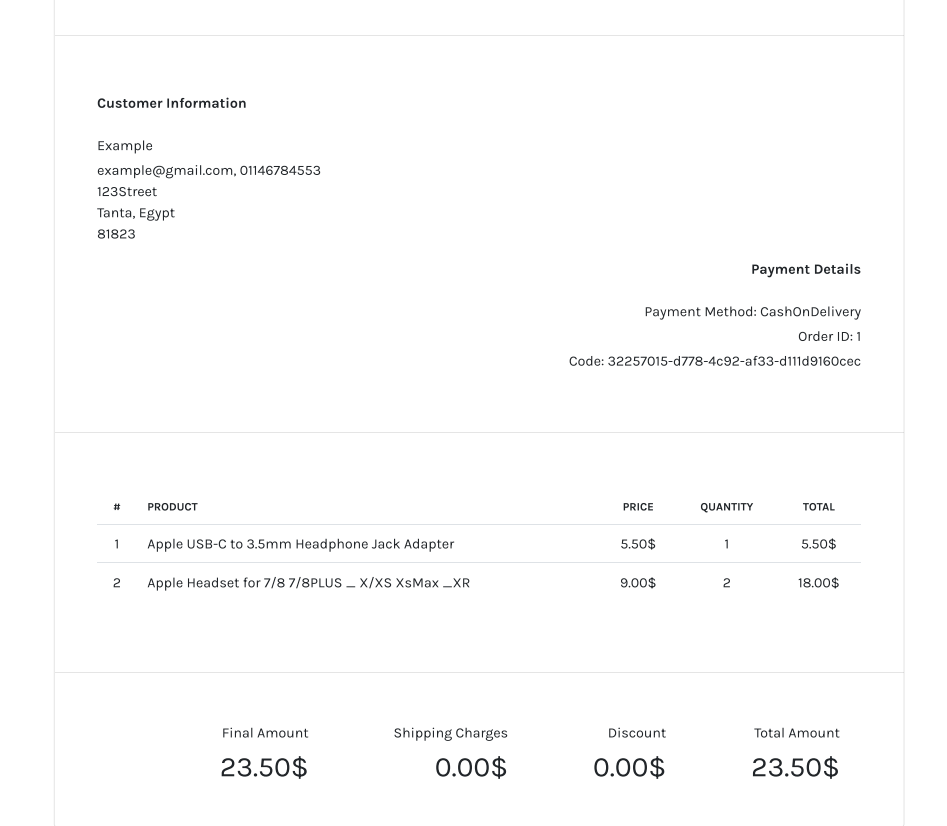
________________________________________________________________________________________________________________________________________________
<pre> ═══════════════ Admin Login ═══════════════ </pre>
________________________________________________________________________________________________________________________________________________
## Dashboard
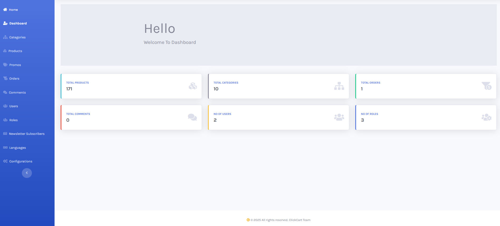
________________________________________________________________________________________________________________________________________________
## Categories
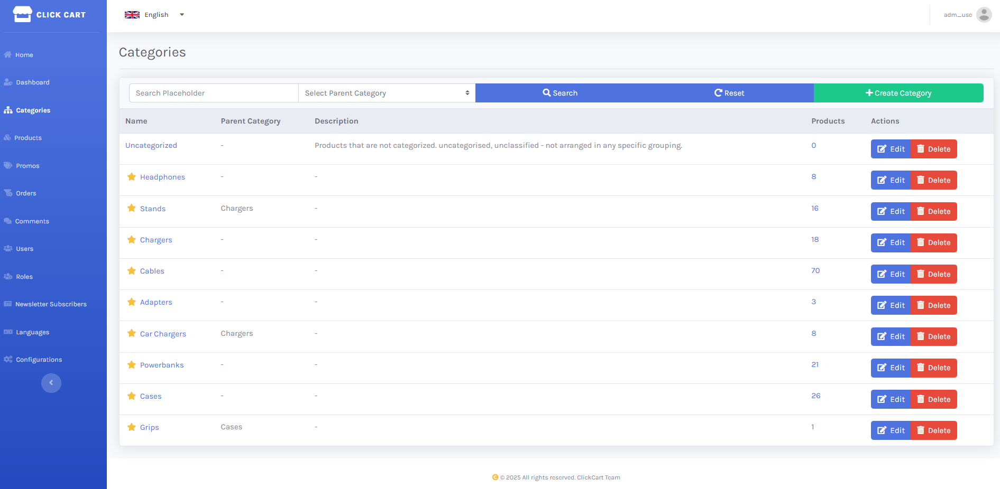
________________________________________________________________________________________________________________________________________________
## Products
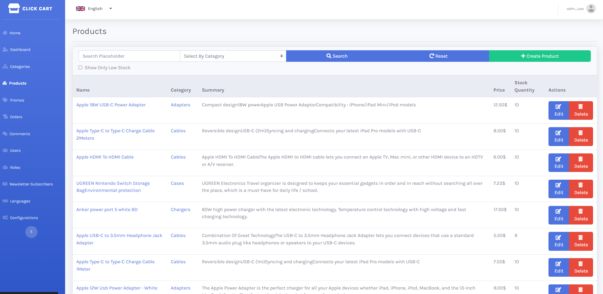
________________________________________________________________________________________________________________________________________________
## Comments
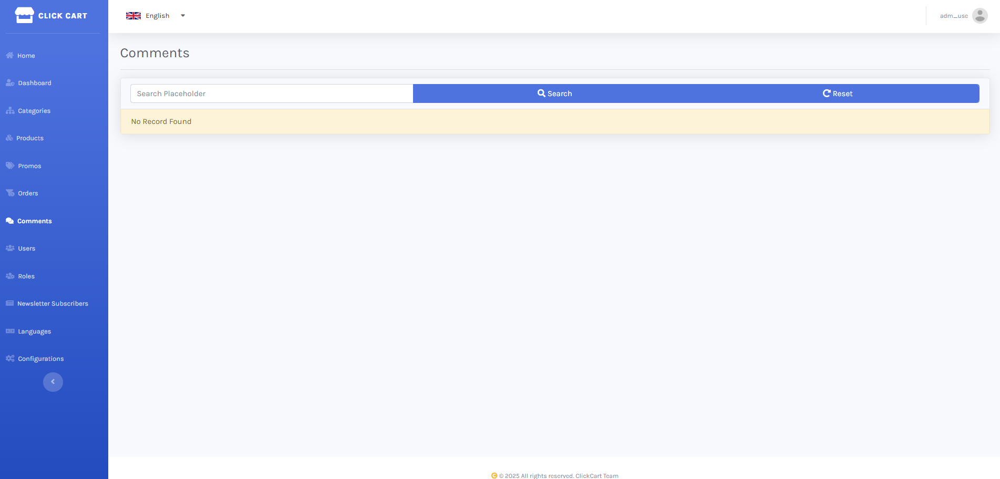
________________________________________________________________________________________________________________________________________________
## languages
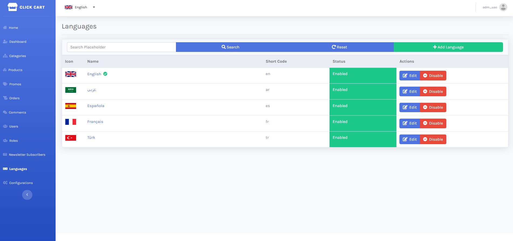
________________________________________________________________________________________________________________________________________________
## Feedback
If you have any feedback, please reach out to us at 
mh1191128@gmail.com
houndasadiq@gmail.com
adhmassem02@gmail.com

